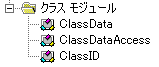
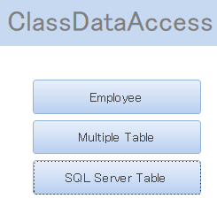
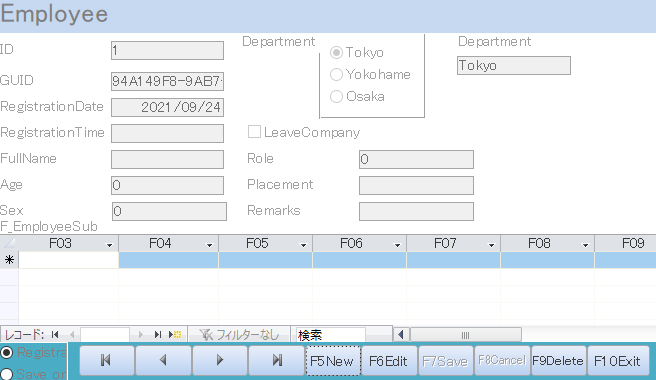
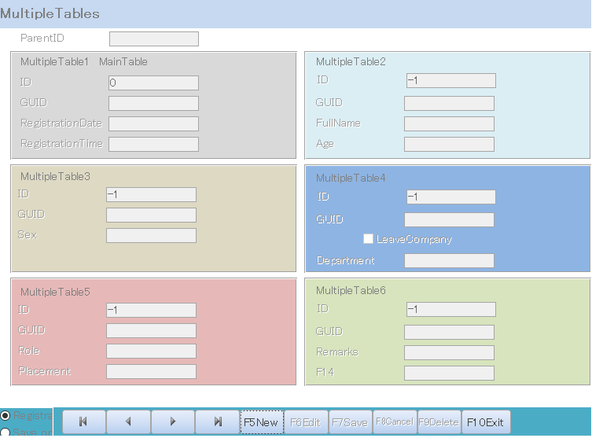
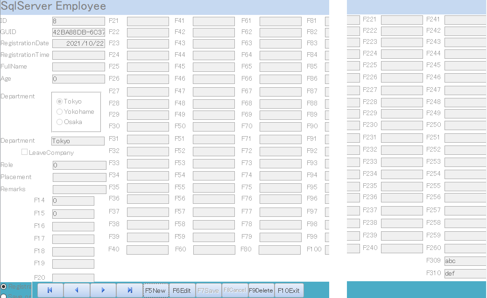
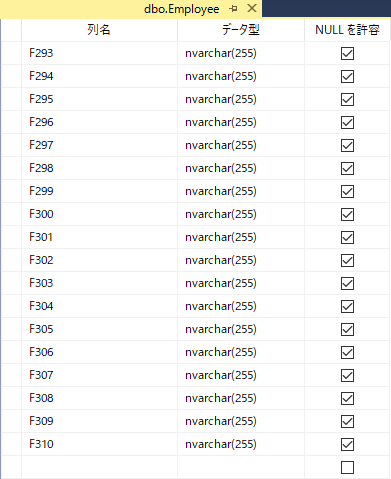
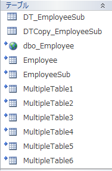
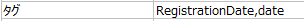

# ClassDataAccess is a class for connecting to SQL Server or accdb table from MicrosoftAccess Form and displaying / saving data in controls.

## Using SQL Server for the database allows you to place controls on forms and connect to tables beyond the Access field limit of 255.
### (There is a limit of 754 controls that can be placed on an Access form)
## The control source of the control is unbound.
#
## ClassDataAccess uses transactions to store data.
## ● When there are multiple subforms placed on a form, new / edit / save of the parent table and multiple subtables can be processed in a single bundle using transactions.
## ● Many controls that connect to multiple tables can be placed on one form, and transactions can be used to process new / edit / save in a single bundle.
#
## You can operate the data by arranging the edit button, save button, etc. on the form.

## The sample program has three forms.

- Form / subform support

- Supports multiple tables

- SQL Server table support

#
## The original table that was connected to SQL Server in the sample has 310 fields. All fields are not visible in the accdb table design. You can manipulate the data by placing controls for all fields on the form. In the sample, 262 controls are placed.

#
## For subform, create and use the table in this accdb as a temporary table for both accdb and SQL Server. "DT_" and "DTCOPY_" are added to the temporary table name. This limits the number of fields in the subform to 255.

#
## To connect a control on a form to a table field, write the field name and data type in the control's tag. You can read and write with just this.

#
## Describe the predetermined items below.
### Tables and subtables have required fields.
### The text box on the form has required fields.
### During programming, there are conventions for initializing a class.
### The control tag description has a format.
### On the form, there is only one control for each field.
### others
##### (used Google Translate)
#
## Releases -> Access 2files -> (ClassDataAccess.accdb and DB.accdb) To use ClassDataAccess.accdb, relink to the tables in DB.accdb
# 
# 
# ClassDataAccessはMicrosoftAccessのFormからSQLServerやaccdbのテーブルに接続してデータをコントロールに表示・保存するためのクラスです。

## データベースにSQLServerを使用すればAccessのフィールドの数の制限255を超えてフォームにコントロールを配置しテーブルと接続できます。
### (Accessのフォームに配置できるコントロール数の制限754があります)
## コントロールのコントロールソースは非連結です。
# 
## ClassDataAccessはトランザクションを使用してデータを保存します。
## ●フォームに配置した複数のサブフォームがあるとき、親テーブルと複数のサブテーブルの新規・編集・保存をトランザクションを使用して１つの束にした状態で処理できます。
## ●１つのフォームに複数のテーブルと接続する多数のコントロールを配置でき、トランザクションを使用して新規・編集・保存を１つの束にした状態で処理できます。
# 
## フォームに編集ボタン・保存ボタン等を配置してデータの操作ができます。

## サンプルプログラムには、３つのフォームがあります。

- フォーム・サブフォーム対応

- 複数テーブル対応

- SQLServerのテーブル対応

# 
## サンプルにあるSQLServerに接続していた元のテーブルにはフィールドが310あります。accdbのテーブルデザインでは全てのフィールドは表示されません。フォームに全フィールドに対応するコントロールを配置してデータを操作することができます。サンプルでは262個のコントロールを配置しています。

# 
## サブフォームの場合、接続先がaccdb、SQLServer共に一時テーブルとしてこのaccdb内のテーブルを作成して使用します。一時テーブル名には、「DT_」「DTCOPY_」が付きます。このためサブフォームのフィールド数は、255に制限されます。

#
## フォーム上のコントロールとテーブルのフィールドを接続するには、コントロールのタグにフィールド名とデータ型タイプを記述します。これだけで読み書きができます。

#
## 以下にあらかじめ決められている項目を記述します。
### テーブル・サブテーブルには、必須項目があります。
### フォームのテキストボックスには、必須項目があります。
### プログラム中、クラスを初期化するには決まり事があります。
### コントロールのタグの記述には、書式があります。
### フォーム上、１つのフィールドに対応するコントロールは１つと決まっています。
### その他
#
## Releases -> Access 2files -> (ClassDataAccess.accdb and DB.accdb) ClassDataAccess.accdb を使用するために DB.accdb の中のテーブルとのリンクを再度接続し直して下さい。